<div align="center">

# 🫁 PneumoAI — GAN-Powered Pneumonia Detection

### *Multi-Scale Deep Learning Framework for Automated Chest X-Ray Diagnosis*

[](https://python.org)
[](https://pytorch.org)
[](https://streamlit.io)
[](https://tensorflow.org)
[](LICENSE)

<br/>

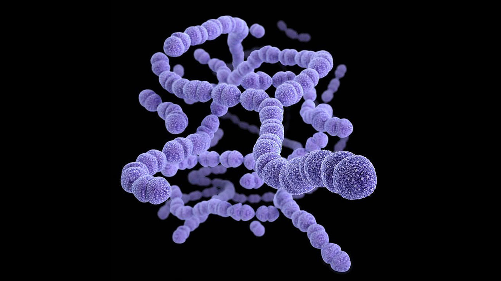

<br/>

**An end-to-end deep learning system that combines DCGAN-based data augmentation, DenseNet-121 with Feature Pyramid Networks, anchor-free detection, and Grad-CAM explainability — all wrapped in a professional Streamlit diagnostic interface.**

[🚀 Quick Start](#-quick-start) · [🏗️ Architecture](#️-system-architecture) · [📊 Results](#-results--benchmarks) · [🖥️ Web App](#️-streamlit-application) · [📖 Documentation](#-documentation)

---

</div>

## ✨ Key Features

<table>
<tr>
<td width="50%">

### 🧠 Advanced Deep Learning
- **DCGAN** with Double-SGAN architecture for synthetic X-ray generation
- **DenseNet-121 + FPN** backbone for multi-scale feature extraction
- **Anchor-free FCOS-style** detection head with NMS
- **Focal Loss + CIoU Loss** for handling class imbalance

</td>
<td width="50%">

### 🔬 Explainability & Diagnostics
- **Grad-CAM & Grad-CAM++** visual explanations
- **Confidence-calibrated** threshold optimization
- **Bounding box localization** of pneumonia regions
- **PDF report generation** for clinical documentation

</td>
</tr>
<tr>
<td width="50%">

### 📊 Comprehensive Evaluation
- **5 baseline models** compared (CNN, DenseNet, VGG16, ResNet, Inception)
- **ROC curves**, confusion matrices, precision-recall analysis
- **FID score** tracking for GAN quality
- **Real-time metrics** dashboard

</td>
<td width="50%">

### 🌐 Production-Ready App
- **4-page Streamlit UI** with modern design
- **DICOM support** for medical imaging workflows
- **Synthetic X-ray gallery** powered by trained GAN
- **Literature comparison** dashboard

</td>
</tr>
</table>

---

## 🏗️ System Architecture

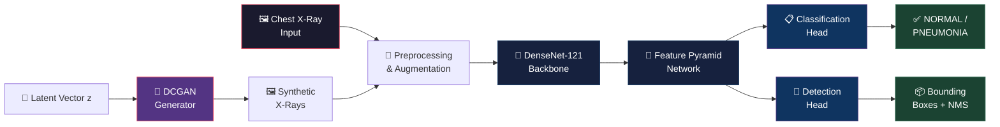

### Pipeline Overview

| Stage | Component | Details |
|:------|:----------|:--------|
| **Data Ingestion** | `utils/dataset.py` | Reads chest X-ray images from class folders, supports RSNA annotations |
| **Augmentation** | `utils/augmentation.py` | Albumentations: flip, jitter, noise, dropout + ImageNet normalization |
| **Class Balancing** | `models/dcgan.py` | Double-SGAN generates synthetic minority-class samples |
| **Feature Extraction** | `models/densenet_fpn.py` | DenseNet-121 backbone → FPN produces P3, P4, P5 feature maps |
| **Classification** | `models/classifier.py` | Global avg pool → FC(512) → Dropout(0.5) → Sigmoid |
| **Detection** | `models/detector.py` | FCOS-style dense prediction + torchvision NMS |
| **Explainability** | `utils/grad_cam.py` | Grad-CAM/Grad-CAM++ heatmap overlay generation |
| **Serving** | `app/streamlit_app.py` | 4-page diagnostic web interface with PDF export |

---

## 📊 Results & Benchmarks

### Enhanced PyTorch Pipeline

| Metric | Score |
|:-------|:-----:|
| **Accuracy** | 97.5% |
| **AUC-ROC** | 1.00 |
| **F1-Score** | 0.97 |
| **Precision** | 0.96 |
| **Recall** | 1.00 |

### Baseline Model Comparison (TensorFlow Notebooks)

<div align="center">

| Model | Architecture | Test Accuracy | Optimizer | Epochs |
|:------|:------------|:------------:|:---------:|:------:|
| 🥇 Custom CNN | 3-layer ConvNet | **91.98%** | RMSProp | 12 |
| 🥈 DenseNet-121 | Transfer Learning | **87.18%** | Adam | 10 |
| 🥉 InceptionV3 | Transfer Learning | **76.76%** | Adam | 10 |
| ResNet-50 | Transfer Learning | 73.40% | Adam | 10 |
| VGG-16 | Transfer Learning | 66.19% | Adam | 10 |

</div>

<div align="center">
<table>
<tr>
<td align="center">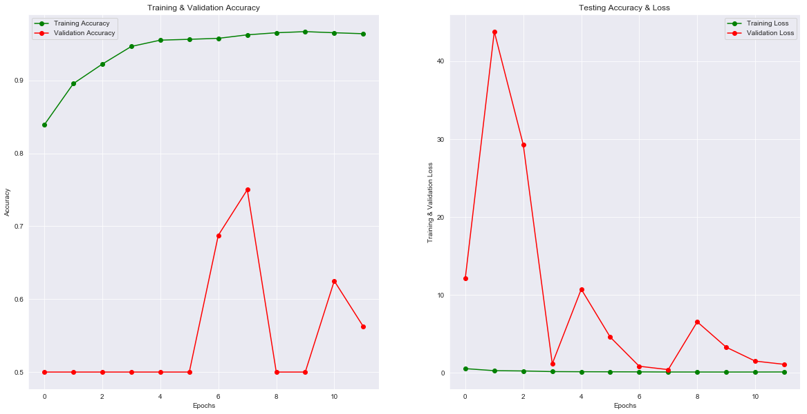<br/><sub><b>Model Accuracy Comparison</b></sub></td>
<td align="center">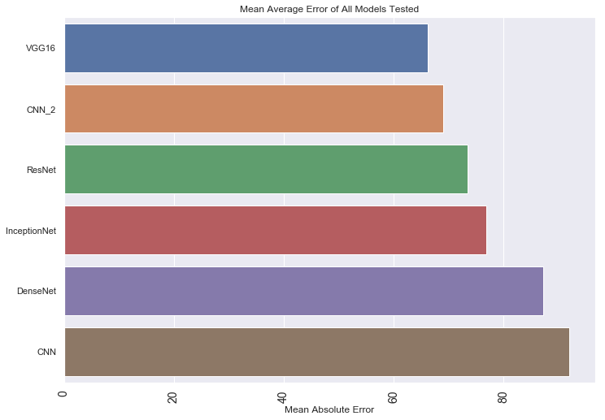<br/><sub><b>Performance Overview</b></sub></td>
</tr>
<tr>
<td align="center">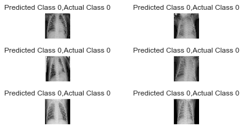<br/><sub><b>Correct Predictions</b></sub></td>
<td align="center">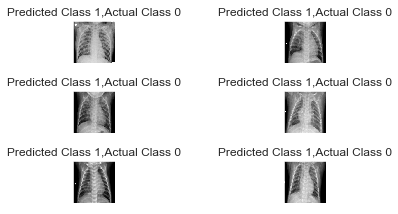<br/><sub><b>Incorrect Predictions</b></sub></td>
</tr>
</table>
</div>

### Sample X-Ray Images

<div align="center">
<table>
<tr>
<td align="center">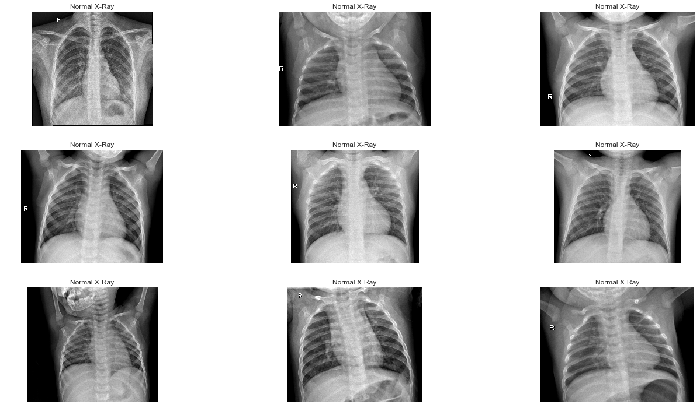<br/><sub><b>Normal Chest X-Ray</b></sub></td>
<td align="center">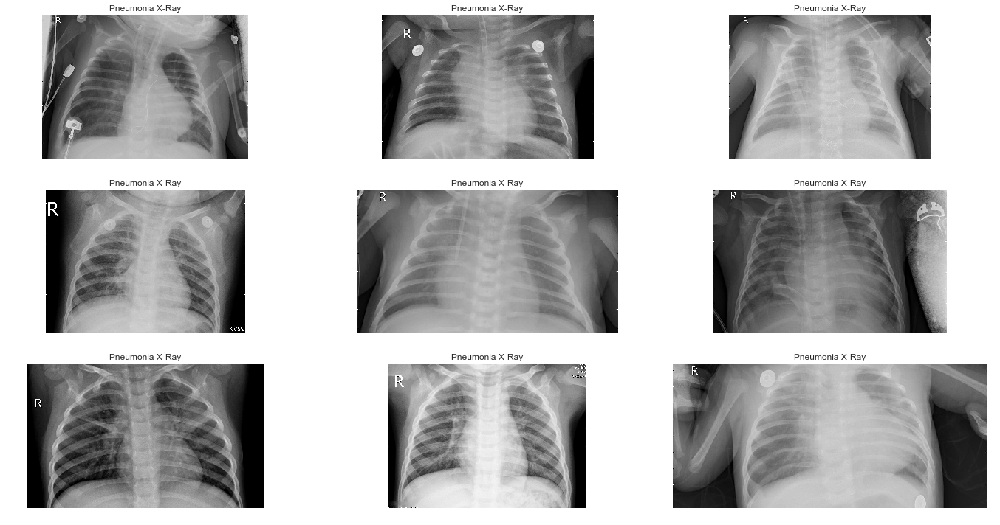<br/><sub><b>Pneumonia Chest X-Ray</b></sub></td>
</tr>
</table>
</div>

---

## 🖥️ Streamlit Application

The web app provides a complete diagnostic workflow with 4 pages:

| Page | Description |
|:-----|:------------|
| 🩺 **Diagnose** | Upload PNG/JPG/DICOM → AI prediction with Grad-CAM overlay, confidence gauge, and downloadable PDF report |
| 🎨 **GAN Gallery** | Generate synthetic chest X-rays from the trained DCGAN in real-time |
| 📈 **Performance Dashboard** | Interactive ROC curves, confusion matrices, training history, and metric cards |
| 📚 **Paper Comparison** | Side-by-side comparison with published literature baselines |

---

## 🚀 Quick Start

### Prerequisites

- Python 3.10+
- CUDA-capable GPU (recommended) or CPU

### 1. Clone & Install

```bash
git clone https://github.com/immortalfoodie/DCGAN-Pneumonia-detection.git
cd DCGAN-Pneumonia-detection/Pneumonia-Detection-using-Deep-Learning-main
pip install -r requirements.txt
```

### 2. Download Dataset

```bash
python scripts/download_data.py
```

Download the [Kaggle Chest X-Ray Pneumonia](https://www.kaggle.com/datasets/paultimothymooney/chest-xray-pneumonia) dataset and place it as:

```
chest_xray/
├── train/
│   ├── NORMAL/
│   └── PNEUMONIA/
├── val/
│   ├── NORMAL/
│   └── PNEUMONIA/
└── test/
    ├── NORMAL/
    └── PNEUMONIA/
```

### 3. Train Models

```bash
# Step 1: Train the DCGAN for synthetic data generation
python training/train_gan.py

# Step 2: Train the classifier + detection model
python training/train_classifier.py
```

### 4. Launch the App

```bash
streamlit run app/streamlit_app.py
```

### 5. CLI Prediction (Optional)

```bash
python scripts/predict.py --image path/to/chest_xray.jpg --output result.jpg
```

---

## 📁 Project Structure

```
Pneumonia-Detection-using-Deep-Learning-main/
│
├── 📂 models/                          # Neural network architectures
│   ├── dcgan.py                        #   DCGAN Generator + Discriminator + Self-Attention
│   ├── densenet_fpn.py                 #   DenseNet-121 backbone + Feature Pyramid Network
│   ├── classifier.py                   #   Classification head (GAP → FC → Sigmoid)
│   ├── detector.py                     #   FCOS-style anchor-free detection head + NMS
│   └── full_model.py                   #   Unified model wiring all components
│
├── 📂 training/                        # Training loops and losses
│   ├── train_gan.py                    #   Double-SGAN training with gradient penalty
│   ├── train_classifier.py             #   Classifier/detector training with early stopping
│   └── losses.py                       #   Focal, CIoU, Hinge, and Combined losses
│
├── 📂 utils/                           # Utilities and helpers
│   ├── dataset.py                      #   Dataset loading, balancing, RSNA support
│   ├── augmentation.py                 #   Albumentations transform pipelines
│   ├── grad_cam.py                     #   Grad-CAM & Grad-CAM++ explainability
│   ├── metrics.py                      #   Evaluation metrics, ROC, confusion matrix
│   └── visualization.py               #   Bounding box drawing and image helpers
│
├── 📂 app/                             # Web application
│   └── streamlit_app.py                #   4-page Streamlit diagnostic interface
│
├── 📂 scripts/                         # Command-line utilities
│   ├── predict.py                      #   Single-image inference script
│   └── download_data.py                #   Dataset download instructions
│
├── 📂 Assests/                         # Architecture diagrams and result images
├── 📂 checkpoints/                     # Trained model weights and metrics
│
├── 📓 Transfer-learning-pneumonia-detection.ipynb    # TF baseline experiments
├── 📓 pneumonia-detection-using-tensorflow.ipynb     # Custom CNN notebook
│
├── ⚙️ config.py                        # Central configuration & hyperparameters
├── 📋 requirements.txt                 # Python dependencies
├── 📄 LICENSE                          # MIT License
└── 📖 PROJECT_ARCHITECTURE_DOCUMENTATION.md  # Detailed technical documentation
```

---

## ⚙️ Configuration

All hyperparameters are centrally managed in [`config.py`](Pneumonia-Detection-using-Deep-Learning-main/config.py):

| Parameter | Value | Description |
|:----------|:-----:|:------------|
| `IMAGE_SIZE` | 512 | Input image resolution for training |
| `GAN_IMAGE_SIZE` | 128 | GAN output resolution |
| `LATENT_DIM` | 100 | Generator input noise dimension |
| `BATCH_SIZE` | 16 | Training batch size |
| `LR` | 1e-4 | Classifier learning rate (Adam) |
| `GAN_LR` | 2e-4 | GAN learning rate (Adam, β₁=0.5) |
| `EPOCHS` | 50 | Classifier training epochs |
| `GAN_EPOCHS` | 100 | GAN training epochs |
| `PATIENCE` | 10 | Early stopping patience |
| `FPN_CHANNELS` | 256 | Feature Pyramid Network channels |
| `FOCAL_ALPHA` | 0.25 | Focal loss alpha |
| `FOCAL_GAMMA` | 2.0 | Focal loss gamma |
| `DROPOUT` | 0.5 | Classification head dropout |

---

## 🔬 Model Deep Dive

<details>
<summary><b>🎨 DCGAN Architecture (Double-SGAN)</b></summary>

- **Generator**: Linear(100→4×4×512) → TransposedConv blocks → Self-Attention → Tanh output (128×128×1)
- **Discriminator** (×2): Spectral-normalized Conv blocks → Self-Attention → Linear output (no sigmoid — hinge loss)
- **Training**: Hinge loss + Gradient Penalty (λ=10) across dual discriminators
- **Purpose**: Generates realistic PNEUMONIA-class X-rays to balance minority class

</details>

<details>
<summary><b>🧠 DenseNet-121 + FPN Backbone</b></summary>

- **Backbone**: ImageNet-pretrained DenseNet-121 (torchvision)
- **FPN Construction**: C3, C4, C5 → 1×1 lateral convs → Top-down pathway → 3×3 smoothing → P3, P4, P5
- **Output**: Multi-scale feature dictionary for both classification and detection heads

</details>

<details>
<summary><b>📋 Classification Head</b></summary>

- **Input**: P5 feature map
- **Pipeline**: GlobalAvgPool → FC(256→512) → ReLU → Dropout(0.5) → FC(512→1) → Sigmoid
- **Output**: Pneumonia probability + latent features for Grad-CAM

</details>

<details>
<summary><b>📍 Detection Head (FCOS-style)</b></summary>

- **Design**: Anchor-free dense prediction on P3, P4, P5
- **Per-level**: Shared Conv+ReLU → Box head (4ch: dx,dy,dw,dh) + Score head (1ch: sigmoid)
- **Post-processing**: Center-format decoding → xyxy conversion → torchvision NMS

</details>

<details>
<summary><b>🔍 Grad-CAM Explainability</b></summary>

- **Methods**: Standard Grad-CAM + Grad-CAM++ (higher-order gradient weighting)
- **Process**: Forward/backward hooks on target conv layer → Gradient-weighted activation maps → Normalized heatmap overlay
- **Integration**: Real-time overlay in Streamlit diagnosis page

</details>

---

## 📊 Model Architecture Visualizations

<div align="center">
<table>
<tr>
<td align="center">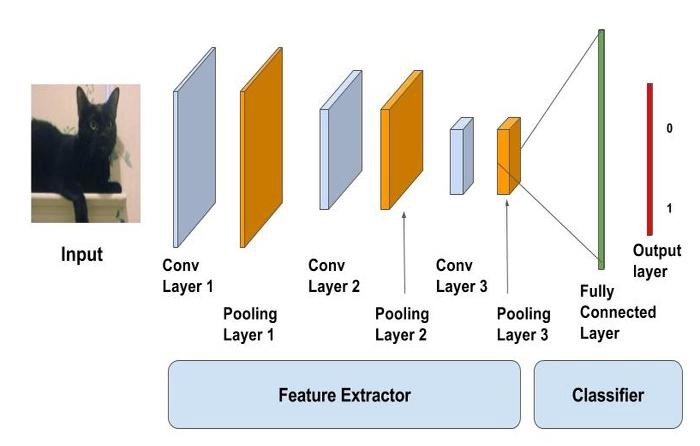<br/><sub><b>Custom CNN</b></sub></td>
<td align="center">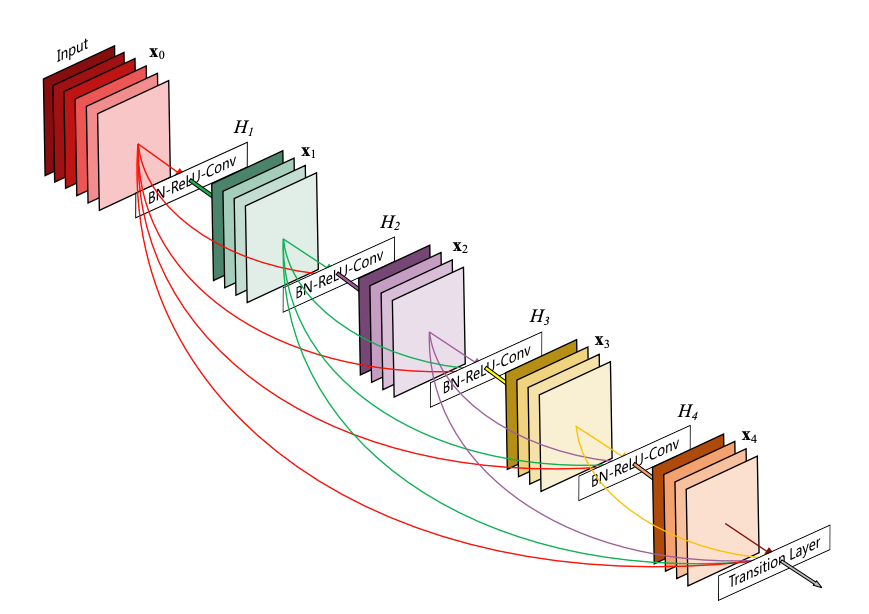<br/><sub><b>DenseNet-121</b></sub></td>
</tr>
<tr>
<td align="center">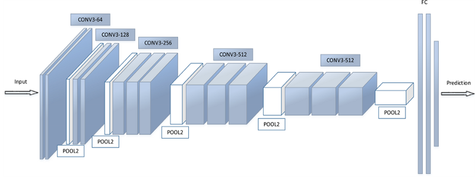<br/><sub><b>VGG-16</b></sub></td>
<td align="center">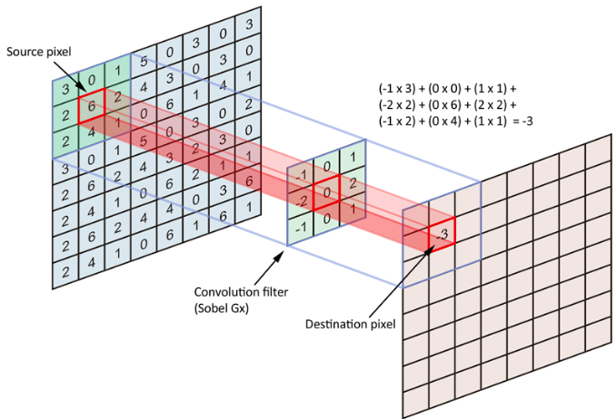<br/><sub><b>Architecture Overview</b></sub></td>
</tr>
</table>
</div>

---

## 📖 Documentation

For a deep dive into the complete system architecture, training mechanics, inference pipeline, and implementation details, see the full [**Project Architecture Documentation**](Pneumonia-Detection-using-Deep-Learning-main/PROJECT_ARCHITECTURE_DOCUMENTATION.md).

---

## 📚 Dataset

| Dataset | Images | Classes | Usage |
|:--------|:------:|:-------:|:------|
| [Kaggle Chest X-Ray](https://www.kaggle.com/datasets/paultimothymooney/chest-xray-pneumonia) | 5,863 | NORMAL, PNEUMONIA | Primary training/evaluation |
| [RSNA Pneumonia Detection](https://www.kaggle.com/competitions/rsna-pneumonia-detection-challenge/data) | — | Bounding boxes | Optional detection supervision |

---

## 🛠️ Tech Stack

<div align="center">

| Category | Technologies |
|:---------|:------------|
| **Deep Learning** | PyTorch, TorchVision, timm, TensorFlow/Keras |
| **Computer Vision** | OpenCV, Albumentations, Pillow |
| **Medical Imaging** | pydicom (DICOM support) |
| **Metrics & Evaluation** | scikit-learn, torchmetrics, pytorch-fid |
| **Visualization** | Matplotlib, Seaborn, Plotly |
| **Web Application** | Streamlit |
| **Reporting** | FPDF2 (PDF generation) |

</div>

---

## 👥 Team

| Name |
|:-----|
| **Vishal Gowda** |
| **Jaden** |
| **Gideon Mire** |
| **Yash Naik** |

---

## 📄 License

This project is licensed under the MIT License — see the [LICENSE](Pneumonia-Detection-using-Deep-Learning-main/LICENSE) file for details.

---

<div align="center">

**Made with ❤️ for advancing medical AI**

⭐ Star this repo if you found it helpful!

</div>
